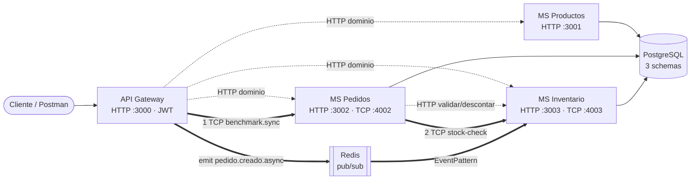
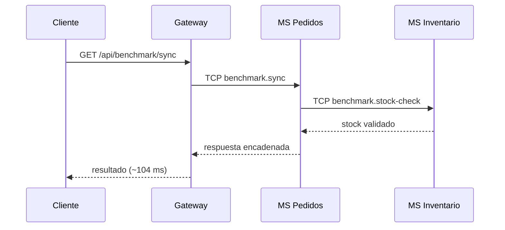
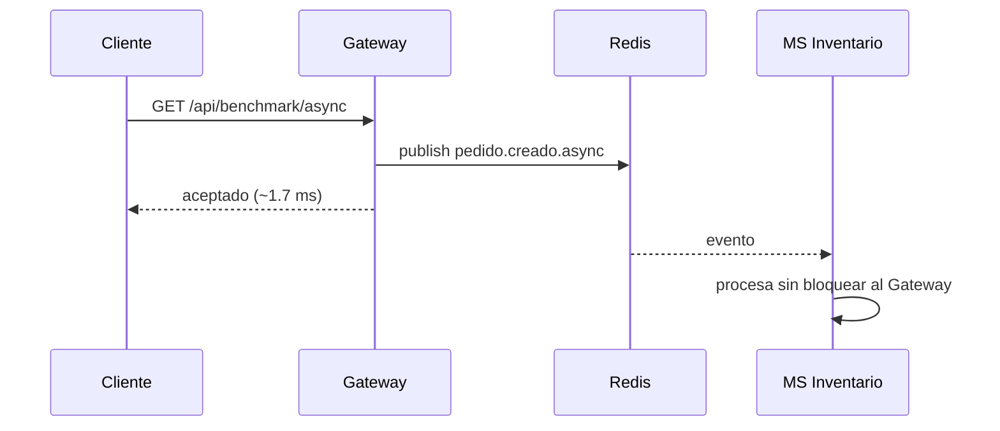
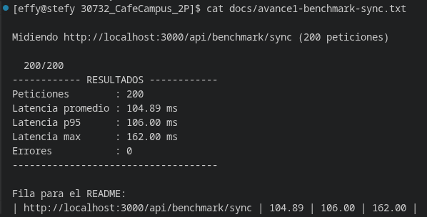
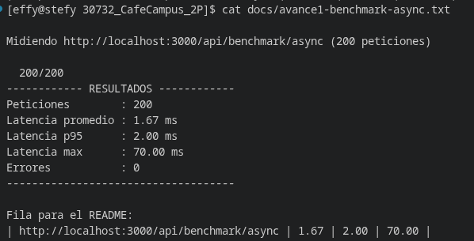

# Cafe Campus

> MVP de arquitectura de microservicios · Aplicaciones Distribuidas · 7.º semestre · Entrega por avances.

Cafe Campus es un sistema de cafetería universitaria construido como **monorepo de microservicios**
(NestJS + TypeScript + Prisma + PostgreSQL). El objetivo pedagógico es **demostrar con datos reales
el acoplamiento temporal y la acumulación de latencia** entre comunicación síncrona y asíncrona.

## Equipo

| Integrante     | Rol                                            | GitHub      |
| -------------- | ---------------------------------------------- | ----------- |
| Marcos Escobar | Arquitectura · API Gateway · Integración       | @IMarcusDev |
| Mateo Sosa     | Backend · Transportes (TCP + Redis)            | @MatSosa1   |
| Stefany Díaz   | Persistencia · Documentación · QA · Mediciones | @Steft91    |

## Descripción del MVP

Cafe Campus administra el catálogo de productos, registra pedidos de estudiantes y controla el
inventario de la cafetería. El dominio se mantiene **deliberadamente simple** para centrar el
esfuerzo en la **arquitectura de comunicación**, las buenas prácticas y la evidencia medible, no
en la lógica de negocio.

- **MS Productos:** catálogo, categorías, precios y disponibilidad (solo HTTP).
- **MS Pedidos:** registra pedidos, calcula totales y coordina validación/descuento de stock.
- **MS Inventario:** controla existencias y movimientos; expone los handlers de benchmark.
- **API Gateway:** punto único de entrada HTTP, autenticación JWT y proxy hacia los servicios.

## Stack

- **Framework:** NestJS + TypeScript · **Estructura:** monorepo (4 apps independientes).
- **Síncrono (Avance 1):** TCP con `@nestjs/microservices` · **Eventos (Avance 1):** Redis PUB/SUB.
- **Persistencia:** PostgreSQL (un `schema` por servicio) · **ORM:** Prisma.
- **Seguridad base:** JWT + Guards por rol en el Gateway · **Contenedores:** Docker Compose.

> **Equivalencia con lo visto en clase:** la guía sugiere **TypeORM**; este proyecto usa **Prisma**,
> que cumple el mismo rol de ORM sobre PostgreSQL. El camino síncrono usa **TCP** y el asíncrono
> **Redis pub/sub**, tal como sugiere el material. En Avance 2 se añadirán gRPC y un segundo transporte.

## Cómo ejecutar

### Opción A — Docker Compose (un solo comando)

```bash
docker compose up -d
docker compose ps

curl http://localhost:3000/api/benchmark/sync
curl http://localhost:3000/api/benchmark/async
```

### Opción B — Local (sin Docker)

Levantar PostgreSQL y Redis, ejecutar migraciones y arrancar en orden:

```bash
# 1) Migraciones (dentro de cada servicio con Prisma)
cd ms-productos  && npx prisma migrate dev --schema src/prisma/schema.prisma && npm run seed
cd ../ms-inventario && npx prisma migrate dev --schema src/prisma/schema.prisma && npm run seed
cd ../ms-pedidos && npx prisma migrate dev --schema src/prisma/schema.prisma

# 2) Arranque en orden
cd ms-productos && npm run start:dev
cd ms-inventario && npm run start:dev
cd ms-pedidos && npm run start:dev
cd gateway && npm run start:dev
```

### Puertos

| Servicio      | HTTP                  | TCP (microservicio)       |
| ------------- | --------------------- | ------------------------- |
| gateway       | 3000 (prefijo `/api`) | —                         |
| ms-productos  | 3001                  | —                         |
| ms-pedidos    | 3002                  | 4002                      |
| ms-inventario | 3003                  | 4003 (+ suscriptor Redis) |

## Arquitectura


> Diagrama generado con **PlantUML**. Fuente:
> [`arquitectura-avance1.puml`](docs/planificacion-avance1/arquitectura-avance1.puml) ·
> versión vectorial: [`arquitectura-avance1.svg`](docs/planificacion-avance1/arquitectura-avance1.svg).
> Regenerar con: `plantuml -tpng docs/planificacion-avance1/arquitectura-avance1.puml`

Vista simplificada de los dos caminos:



### Camino síncrono (TCP)



### Camino asíncrono (Redis)



## Metodología

- **Kanban:** ver [`TABLERO_KANBAN.md`](TABLERO_KANBAN.md) y el reparto en
  [`docs/planificacion-avance1/01-roles-y-kanban.md`](docs/planificacion-avance1/01-roles-y-kanban.md)
  (captura en `docs/avance1-kanban.png`).
- **Ramificación:** **GitHub Flow** — `main` como rama principal y ramas `feat/…`, `chore/…` y `docs/…` para separar funcionalidades, configuración y documentación. Las ramas se integran mediante Pull Requests y se utiliza un **tag por avance**.
- **Commits semánticos:** Conventional Commits `tipo(alcance): descripción`. Ejemplos:
    ```
    feat(tcp): agregar handler tcp de verificacion de stock
    feat(redis): agregar consumidor asincrono de eventos de pedido
    feat(gateway): agregar proxy http hacia ms-pedidos
    docs(readme): completar seccion avance 1 con analisis y evidencia
    ```

## Patrones y principios aplicados

Resumen (detalle y justificación en
[`docs/planificacion-avance1/02-patrones-y-principios.md`](docs/planificacion-avance1/02-patrones-y-principios.md)):

| Patrón / Principio | ¿Framework o equipo? |
|---|---|
| API Gateway y Proxy | Diseñados por el equipo |
| Publisher/Subscriber (Redis) y Request/Response (TCP) | Equipo, utilizando transportes de NestJS |
| DTO, `ValidationPipe`, inyección de dependencias y módulos | Proporcionados por NestJS y utilizados deliberadamente |
| Excepciones HTTP y manejo controlado de errores | Framework y uso deliberado del equipo |
| SRP, separación de responsabilidades y aislamiento de datos por `schema` | Diseño del equipo |
---

## Avance 1 — Acoplamiento temporal y latencia · `tag v1-avance1`

### Caminos

- **Síncrono (TCP):** Gateway → MS Pedidos → MS Inventario (cada salto espera al siguiente).
- **Asíncrono (Redis):** Gateway publica el evento y responde sin esperar al consumidor.

| Camino    | Endpoint                   | Transporte |
| --------- | -------------------------- | ---------- |
| Síncrono  | `GET /api/benchmark/sync`  | TCP        |
| Asíncrono | `GET /api/benchmark/async` | Redis      |

### Latencia (200 peticiones, `benchmark.js`)

```bash
node benchmark.js http://localhost:3000/api/benchmark/sync 200 > docs/avance1-benchmark-sync.txt
node benchmark.js http://localhost:3000/api/benchmark/async 200 > docs/avance1-benchmark-async.txt
```

| Camino          | Promedio (ms) | p95 (ms) | Máx (ms) | Errores |
| --------------- | ------------: | -------: | -------: | ------: |
| Síncrono TCP    |    **104.89** |   106.00 |   162.00 |       0 |
| Asíncrono Redis |      **1.67** |     2.00 |    70.00 |       0 |

### Acoplamiento temporal (prueba de caída)

Con el stack arriba, se apaga **MS Inventario** (Ctrl+C) y se repiten las peticiones
(evidencia en `docs/avance1-caida-servicio.txt`):

- **Síncrono → falla** con `503 Service Unavailable`: la cadena Gateway→Pedidos→Inventario requiere que todos estén vivos a la vez.
- **Asíncrono → se acepta igual** (`"aceptado": true`, ~1 ms): el Gateway publica el evento en Redis y responde sin esperar una confirmación del consumidor. Esto demuestra un menor acoplamiento temporal desde la perspectiva del emisor.

**Resultados del benchmark del camino síncrono**



**Resultados del benchmark del camino asíncrono**



### Análisis

En el camino **síncrono**, cada salto espera la respuesta del siguiente antes de continuar, por lo que los tiempos de procesamiento se acumulan. El promedio medido fue de **104.89 ms**, valor coherente con los retardos artificiales de MS Pedidos (40 ms) y MS Inventario (60 ms), además del costo de comunicación entre procesos. La prueba de caída también evidenció **acoplamiento temporal**: al detener MS Inventario, la cadena no pudo completarse y el Gateway respondió con un error **503 Service Unavailable**.

En el camino **asíncrono**, el Gateway publica un evento mediante Redis Pub/Sub y responde sin esperar que MS Inventario complete su procesamiento. Por esta razón, el promedio de respuesta fue de **1.67 ms**. Incluso con el consumidor detenido, el Gateway aceptó la solicitud y respondió correctamente, evidenciando un menor acoplamiento temporal desde la perspectiva del emisor.

Sin embargo, Redis Pub/Sub utiliza mensajería no persistente. Por ello, esta implementación demuestra desacoplamiento temporal y reducción del tiempo de respuesta, pero no garantiza que un evento publicado mientras el consumidor está detenido sea procesado posteriormente.

Análisis ampliado en
[`docs/planificacion-avance1/03-analisis-latencia-acoplamiento.md`](docs/planificacion-avance1/03-analisis-latencia-acoplamiento.md).

---

## Avance 2 — Comunicación: gRPC + 2.º transporte + excepciones · `tag v2-avance2`

_Pendiente._ Contrato `.proto` (gRPC) entre dos microservicios, segundo transporte
(RabbitMQ/MQTT/NATS), tabla comparativa de transportes y manejo de excepciones con evidencia.

## Avance 3 — Seguridad, observabilidad e integración (FINAL) · `tag v3-final`

_Pendiente._ Login que emite JWT y Guard que protege rutas (200 con token / 401 sin token / 403 por
rol), observabilidad con Sentry, integración final y sección de defensa.

## Defensa

_Pendiente (Avance 3)._

## Tags de entrega

- `v1-avance1` — 2026-07-14
- `v2-avance2` — pendiente
- `v3-final` — pendiente
