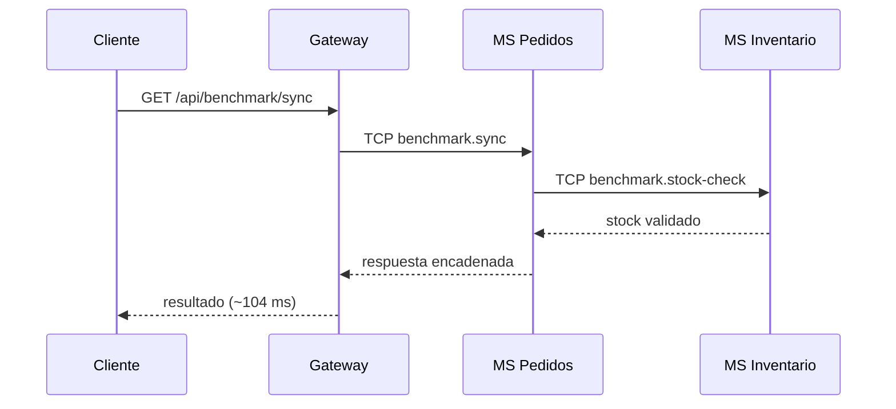
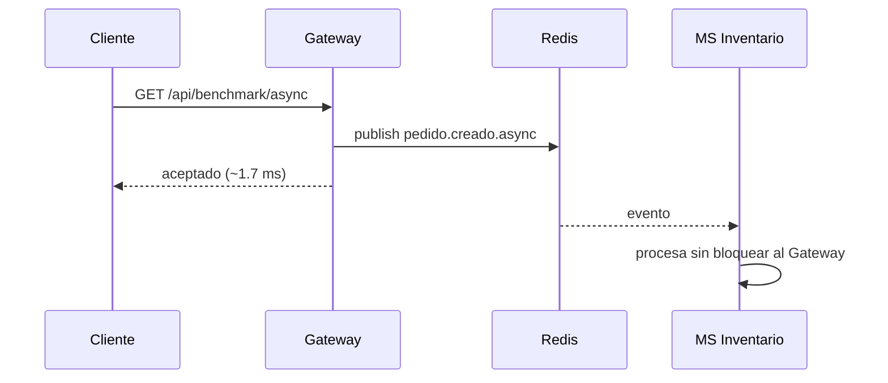
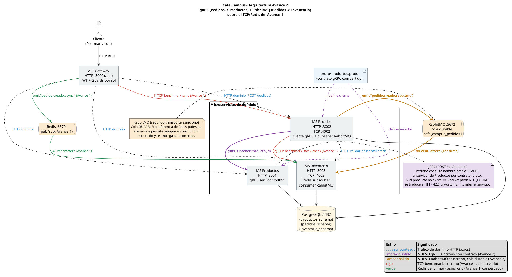

# Cafe Campus

> MVP de arquitectura de microservicios · Aplicaciones Distribuidas · 7.º semestre · Entrega por avances.

Cafe Campus es un sistema de cafetería universitaria construido como **monorepo de microservicios**
(NestJS + TypeScript + Prisma + PostgreSQL). El objetivo pedagógico es analizar diferentes mecanismos de comunicación entre
microservicios, incluyendo TCP, Redis Pub/Sub, gRPC y RabbitMQ, junto con su
acoplamiento temporal, latencia, contratos y manejo de excepciones.

## Equipo

| Integrante | Rol | GitHub |
|---|---|---|
| Marcos Escobar | Arquitectura · API Gateway · Infraestructura · Servidor gRPC | @IMarcusDev |
| Mateo Sosa | Backend · Inventario · Consumer TCP, Redis y RabbitMQ | @MatSosa1 |
| Stefany Díaz | Pedidos · Cliente gRPC · Publisher RabbitMQ · Documentación y QA | @Steft91 |

## Descripción del MVP

Cafe Campus administra el catálogo de productos, registra pedidos de estudiantes y controla el
inventario de la cafetería. El dominio se mantiene **deliberadamente simple** para centrar el
esfuerzo en la **arquitectura de comunicación**, las buenas prácticas y la evidencia medible, no
en la lógica de negocio.

- **MS Productos:** catálogo, categorías, precios y disponibilidad mediante HTTP y gRPC.
- **MS Pedidos:** registra pedidos, consulta Productos mediante gRPC, calcula totales y publica eventos RabbitMQ.
- **MS Inventario:** controla existencias, procesa eventos Redis y consume eventos RabbitMQ.
- **API Gateway:** punto único de entrada HTTP, autenticación JWT y proxy hacia los servicios.

- **gRPC (Avance 2):** comunicación síncrona con contrato `.proto` entre Pedidos y Productos.
- **RabbitMQ (Avance 2):** comunicación asíncrona basada en cola entre Pedidos e Inventario.

## Stack

- **Framework:** NestJS + TypeScript · **Estructura:** monorepo (4 apps independientes).
- **Síncrono (Avance 1):** TCP con `@nestjs/microservices` · **Eventos (Avance 1):** Redis PUB/SUB.
- **Persistencia:** PostgreSQL (un `schema` por servicio) · **ORM:** Prisma.
- **Seguridad base:** JWT + Guards por rol en el Gateway · **Contenedores:** Docker Compose.

> **Equivalencia con lo visto en clase:** la guía sugiere **TypeORM**; este proyecto usa **Prisma**,
> que cumple el mismo rol de ORM sobre PostgreSQL. El camino síncrono usa **TCP** y el asíncrono
> **Redis pub/sub**, tal como sugiere el material.

## Cómo ejecutar

### Opción A — Docker Compose (un solo comando)

```bash
docker compose up -d
docker compose ps

curl http://localhost:3000/api/benchmark/sync
curl http://localhost:3000/api/benchmark/async
```

Ese compose ya ejecuta `prisma migrate deploy` en `ms-productos`,
`ms-inventario` y `ms-pedidos`, así que las tablas se crean al levantar el stack.
Si vas a probar el flujo real de pedidos sobre una base limpia, siembra primero:

```bash
docker compose exec ms-productos npm run seed
docker compose exec ms-inventario npm run seed
```

### Opción B — Local (sin Docker)

Levantar PostgreSQL y Redis, ejecutar migraciones y arrancar en orden:

```bash
# 1) Migraciones (dentro de cada servicio con Prisma)
cd ms-productos  && npx prisma migrate dev --schema src/prisma/schema.prisma && npm run seed
cd ../ms-inventario && npx prisma migrate dev --schema src/prisma/schema.prisma && npm run seed
cd ../ms-pedidos && npx prisma migrate dev --schema src/prisma/schema.prisma

# 2) Arranque en orden
cd ms-productos && npm run start:dev
cd ms-inventario && npm run start:dev
cd ms-pedidos && npm run start:dev
cd gateway && npm run start:dev
```

### Puertos

| Servicio | HTTP | Otros transportes |
|---|---:|---|
| Gateway | 3000 (`/api`) | — |
| MS Productos | 3001 | gRPC 50051 |
| MS Pedidos | 3002 | TCP 4002 · cliente gRPC · publisher RabbitMQ |
| MS Inventario | 3003 | TCP 4003 · Redis · consumer RabbitMQ |
| PostgreSQL | 5432 | — |
| Redis | 6379 | Pub/Sub |
| RabbitMQ | — | AMQP 5672 |
## Arquitectura


> Diagrama generado con **PlantUML**. Fuente:
> [`arquitectura-avance1.puml`](docs/planificacion-avance1/arquitectura-avance1.puml) ·
> versión vectorial: [`arquitectura-avance1.svg`](docs/planificacion-avance1/arquitectura-avance1.svg).
> Regenerar con: `plantuml -tpng docs/planificacion-avance1/arquitectura-avance1.puml`

Vista simplificada de los dos caminos:


### Camino síncrono (TCP)



### Camino asíncrono (Redis)



## Metodología

- **Kanban:** ver [`TABLERO_KANBAN.md`](TABLERO_KANBAN.md) y el reparto en
  [`docs/planificacion-avance1/01-roles-y-kanban.md`](docs/planificacion-avance1/01-roles-y-kanban.md)
  (captura en `docs/avance1-evidencias/avance1-kanban.png`).
- **Ramificación:** **GitHub Flow** — `main` como rama principal y ramas `feat/…`, `chore/…` y `docs/…` para separar funcionalidades, configuración y documentación. Las ramas se integran mediante Pull Requests y se utiliza un **tag por avance**.
- **Commits semánticos:** Conventional Commits `tipo(alcance): descripción`. Ejemplos:
    ```
    feat(tcp): agregar handler tcp de verificacion de stock
    feat(redis): agregar consumidor asincrono de eventos de pedido
    feat(gateway): agregar proxy http hacia ms-pedidos
    docs(readme): completar seccion avance 1 con analisis y evidencia
    ```

## Patrones y principios aplicados

Resumen (detalle y justificación en
[`docs/planificacion-avance1/02-patrones-y-principios.md`](docs/planificacion-avance1/02-patrones-y-principios.md)):

| Patrón / Principio | ¿Framework o equipo? |
|---|---|
| API Gateway y Proxy | Diseñados por el equipo |
| Publisher/Subscriber (Redis) y Request/Response (TCP) | Equipo, utilizando transportes de NestJS |
| DTO, `ValidationPipe`, inyección de dependencias y módulos | Proporcionados por NestJS y utilizados deliberadamente |
| Excepciones HTTP y manejo controlado de errores | Framework y uso deliberado del equipo |
| SRP, separación de responsabilidades y aislamiento de datos por `schema` | Diseño del equipo |
---

## Avance 1 — Acoplamiento temporal y latencia · `tag v1-avance1`

### Caminos

- **Síncrono (TCP):** Gateway → MS Pedidos → MS Inventario (cada salto espera al siguiente).
- **Asíncrono (Redis):** Gateway publica el evento y responde sin esperar al consumidor.

| Camino    | Endpoint                   | Transporte |
| --------- | -------------------------- | ---------- |
| Síncrono  | `GET /api/benchmark/sync`  | TCP        |
| Asíncrono | `GET /api/benchmark/async` | Redis      |

### Latencia (200 peticiones, `benchmark.js`)

```bash
node benchmark.js http://localhost:3000/api/benchmark/sync 200 > docs/avance1-evidencias/avance1-benchmark-sync.txt
node benchmark.js http://localhost:3000/api/benchmark/async 200 > docs/avance1-evidencias/avance1-benchmark-async.txt
```

| Camino          | Promedio (ms) | p95 (ms) | Máx (ms) | Errores |
| --------------- | ------------: | -------: | -------: | ------: |
| Síncrono TCP    |    **104.89** |   106.00 |   162.00 |       0 |
| Asíncrono Redis |      **1.67** |     2.00 |    70.00 |       0 |

### Acoplamiento temporal (prueba de caída)

Con el stack arriba, se apaga **MS Inventario** (Ctrl+C) y se repiten las peticiones
(evidencia en `docs/avance1-evidencias/avance1-caida-servicio.txt`):

- **Síncrono → falla** con `503 Service Unavailable`: la cadena Gateway→Pedidos→Inventario requiere que todos estén vivos a la vez.
- **Asíncrono → se acepta igual** (`"aceptado": true`, ~1 ms): el Gateway publica el evento en Redis y responde sin esperar una confirmación del consumidor. Esto demuestra un menor acoplamiento temporal desde la perspectiva del emisor.

**Resultados del benchmark del camino síncrono**


**Resultados del benchmark del camino asíncrono**


### Análisis

En el camino **síncrono**, cada salto espera la respuesta del siguiente antes de continuar, por lo que los tiempos de procesamiento se acumulan. El promedio medido fue de **104.89 ms**, valor coherente con los retardos artificiales de MS Pedidos (40 ms) y MS Inventario (60 ms), además del costo de comunicación entre procesos. La prueba de caída también evidenció **acoplamiento temporal**: al detener MS Inventario, la cadena no pudo completarse y el Gateway respondió con un error **503 Service Unavailable**.

En el camino **asíncrono**, el Gateway publica un evento mediante Redis Pub/Sub y responde sin esperar que MS Inventario complete su procesamiento. Por esta razón, el promedio de respuesta fue de **1.67 ms**. Incluso con el consumidor detenido, el Gateway aceptó la solicitud y respondió correctamente, evidenciando un menor acoplamiento temporal desde la perspectiva del emisor.

Sin embargo, Redis Pub/Sub utiliza mensajería no persistente. Por ello, esta implementación demuestra desacoplamiento temporal y reducción del tiempo de respuesta, pero no garantiza que un evento publicado mientras el consumidor está detenido sea procesado posteriormente.

Análisis ampliado en
[`docs/planificacion-avance1/03-analisis-latencia-acoplamiento.md`](docs/planificacion-avance1/03-analisis-latencia-acoplamiento.md).

---

## Avance 2 — Comunicación gRPC + RabbitMQ + excepciones · `tag v2-avance2`

### Comunicación gRPC

MS Pedidos consulta a MS Productos mediante gRPC antes de crear un pedido. El
contrato compartido se encuentra en [`proto/productos.proto`](proto/productos.proto).

El cliente envía únicamente `productoId` y `cantidad`. MS Pedidos obtiene mediante
gRPC el nombre, precio y disponibilidad reales del producto, evitando confiar en
valores proporcionados por el cliente.

### Flujo RabbitMQ

Después de crear el pedido, MS Pedidos publica el evento
`pedido.creado.rabbitmq`. MS Inventario consume el evento mediante
`@EventPattern`, utilizando una cola configurada como durable.

### Manejo de excepciones

Cuando se consulta un producto inexistente, MS Productos devuelve una
`RpcException` con código `NOT_FOUND`. MS Pedidos captura el error mediante
`try/catch` y lo traduce a una respuesta HTTP `422 Unprocessable Entity`, sin
detener ninguno de los servicios.

Además, `ms-pedidos` y `ms-inventario` registran un filtro RPC global para que
cualquier excepción HTTP inesperada dentro de handlers microservicio se traduzca
a semántica RPC en vez de romper el flujo.

### Comparación de transportes

| Transporte | Tipo | Patrón | Uso |
|---|---|---|---|
| TCP | Síncrono | Petición-respuesta | Benchmark Gateway → Pedidos → Inventario |
| Redis | Asíncrono | Pub/Sub efímero | Evento del benchmark del Avance 1 |
| gRPC | Síncrono | RPC con contrato `.proto` | Consulta Pedidos → Productos |
| RabbitMQ | Asíncrono | Evento sobre cola | Publicación Pedidos → Inventario |

Documentación ampliada:

- [Comparación de transportes y excepciones](docs/planificacion-avance2/03-comparacion-transportes-excepciones.md)
- [Patrones y principios aplicados](docs/planificacion-avance2/02-patrones-y-principios.md)
- [Roles y Kanban](docs/planificacion-avance2/01-roles-y-kanban.md)

### Evidencias

- [Pedido exitoso mediante gRPC](docs/avance2-evidencias/pedidos-grpc-rabbitmq.txt)
- [Captura del pedido exitoso](docs/avance2-evidencias/avance2-pedido-grpc-rabbitmq.png)
- [Evento RabbitMQ consumido](docs/avance2-evidencias/rabbitmq-inventario.txt)
- [Captura del consumidor RabbitMQ](docs/avance2-evidencias/avance2-rabbitmq-inventario-log.png)
- [Error gRPC controlado](docs/avance2-evidencias/error-producto-inexistente-grpc.txt)
- [Captura del error HTTP 422](docs/avance2-evidencias/avance2-error-producto-inexistente-grpc.png)

### Arquitectura del Avance 2



### Cómo probar el flujo del Avance 2

1. Levanta el stack:

   ```bash
   docker compose up -d
   ```

2. Si la base está limpia, siembra datos:

   ```bash
   docker compose exec ms-productos npm run seed
   docker compose exec ms-inventario npm run seed
   ```

3. Obtén un `productoId` válido:

   ```bash
   curl http://localhost:3001/productos
   ```

4. Crea un pedido contra `ms-pedidos`:

   ```bash
   curl -X POST http://localhost:3002/pedidos \
     -H "Content-Type: application/json" \
     -d '{"usuarioId":"1","items":[{"productoId":"PEGA_AQUI_UN_ID_REAL","cantidad":1}]}'
   ```

5. Observa el consumo RabbitMQ en inventario:

   ```bash
   docker compose logs -f ms-inventario
   ```

6. Prueba el error controlado con un producto inexistente:

   ```bash
   curl -X POST http://localhost:3002/pedidos \
     -H "Content-Type: application/json" \
     -d '{"usuarioId":"1","items":[{"productoId":"producto-inexistente","cantidad":1}]}'
   ```

   Debe responder `422 Unprocessable Entity` y mostrar el mensaje traducido
   por gRPC, sin tumbar los servicios.


## Avance 3 — Seguridad, observabilidad e integración (FINAL) · `tag v3-final`

_Pendiente._ Login que emite JWT y Guard que protege rutas (200 con token / 401 sin token / 403 por
rol), observabilidad con Sentry, integración final y sección de defensa.

## Defensa

_Pendiente (Avance 3)._

## Tags de entrega

- `v1-avance1` — 2026-07-14
- `v2-avance2` — 2026-07-17
- `v3-final` — pendiente
