# Cafe Campus

> MVP de arquitectura de microservicios · Aplicaciones Distribuidas · 7.º semestre · Entrega por avances.

Cafe Campus es un sistema de cafetería universitaria construido como **monorepo de microservicios**
(NestJS + TypeScript + Prisma + PostgreSQL) con **frontend Angular** para el demo final.
El objetivo pedagógico es analizar diferentes mecanismos de comunicación entre
microservicios, incluyendo TCP, Redis Pub/Sub, gRPC y RabbitMQ, junto con su
acoplamiento temporal, latencia, contratos, seguridad, observabilidad y manejo
de excepciones.

## Equipo

| Integrante | Rol | GitHub |
|---|---|---|
| Marcos Escobar | Arquitectura · API Gateway · Infraestructura · Servidor gRPC | @IMarcusDev |
| Mateo Sosa | Backend · Inventario · Consumer TCP, Redis y RabbitMQ | @MatSosa1 |
| Stefany Díaz | Pedidos · Cliente gRPC · Publisher RabbitMQ · Documentación y QA | @Steft91 |

## Descripción del MVP

Cafe Campus administra el catálogo de productos, registra pedidos de estudiantes y controla el
inventario de la cafetería. El dominio se mantiene **deliberadamente simple** para centrar el
esfuerzo en la **arquitectura de comunicación**, las buenas prácticas y la evidencia medible, no
en la lógica de negocio.

- **MS Productos:** catálogo, categorías, precios y disponibilidad mediante HTTP y gRPC.
- **MS Pedidos:** registra pedidos, consulta Productos mediante gRPC, calcula totales y publica eventos RabbitMQ.
- **MS Inventario:** controla existencias, procesa eventos Redis y consume eventos RabbitMQ.
- **API Gateway:** punto único de entrada HTTP, autenticación JWT y proxy hacia los servicios.
- **Frontend Angular:** interfaz de demo para estudiante, mesero y admin conectada al Gateway.

- **gRPC (Avance 2):** comunicación síncrona con contrato `.proto` entre Pedidos y Productos.
- **RabbitMQ (Avance 2):** comunicación asíncrona basada en cola entre Pedidos e Inventario.

## Stack

- **Frontend:** Angular + TypeScript.
- **Backend:** NestJS + TypeScript · **Estructura:** monorepo (4 apps independientes).
- **Síncrono (Avance 1):** TCP con `@nestjs/microservices` · **Eventos (Avance 1):** Redis PUB/SUB.
- **Avance 2:** gRPC para consulta de productos y RabbitMQ como segundo transporte asíncrono.
- **Persistencia:** PostgreSQL (un `schema` por servicio) · **ORM:** Prisma.
- **Seguridad y observabilidad:** JWT + Guards por rol en el Gateway · Sentry.
- **Contenedores:** Docker Compose para backend e infraestructura; frontend local para demo.

> **Equivalencia con lo visto en clase:** la guía sugiere **TypeORM**; este proyecto usa **Prisma**,
> que cumple el mismo rol de ORM sobre PostgreSQL. El camino síncrono usa **TCP** y el asíncrono
> **Redis pub/sub**, tal como sugiere el material.

## Cómo ejecutar

### Opción A — Docker Compose (un solo comando)

```bash
docker compose up -d
docker compose ps

curl http://localhost:3000/api/benchmark/sync
curl http://localhost:3000/api/benchmark/async
```

Ese compose ya ejecuta `prisma migrate deploy` en `ms-productos`,
`ms-inventario` y `ms-pedidos`, así que las tablas se crean al levantar el stack.
Si vas a probar el flujo real de pedidos sobre una base limpia, siembra primero:

```bash
docker compose exec ms-productos npm run seed
docker compose exec ms-inventario npm run seed
```

Para la entrega final con JWT/Sentry/RabbitMQ y puertos sin conflicto:

```bash
cp .env.example .env
# Editar .env solo si se quiere activar Sentry o cambiar JWT/delays.
docker compose -f docker-compose.final.yml up -d
docker compose -f docker-compose.final.yml ps
```

Ese compose final también ejecuta `prisma migrate deploy` en los tres
microservicios con base de datos. Si se levanta una base nueva, después de que
los contenedores estén arriba solo falta sembrar datos:

```bash
docker compose -f docker-compose.final.yml exec ms-productos npm run seed
docker compose -f docker-compose.final.yml exec -e MS_PRODUCTOS_URL=http://ms-productos:3001 ms-inventario npm run seed
```

### Frontend Angular

El frontend se ejecuta localmente y consume el Gateway en `http://localhost:3000/api`:

```bash
cd frontend
npm install
npm run start
```

Abrir `http://localhost:4200`. Cuentas demo:

| Rol | Correo | Clave | Funcionalidad |
|---|---|---|---|
| Estudiante | `estudiante@campus.edu` | `est123` | Menú, carrito, creación de pedido y seguimiento de estado. |
| Mesero | `personal@campus.edu` | `personal123` | Atención de pedidos y cambio de estados. |
| Admin | `admin@campus.edu` | `admin123` | Administración de productos y supervisión de pedidos. |

### Opción B — Local (sin Docker)

Levantar PostgreSQL y Redis, ejecutar migraciones y arrancar en orden:

```bash
# 1) Migraciones (dentro de cada servicio con Prisma)
cd ms-productos  && npx prisma migrate dev --schema src/prisma/schema.prisma && npm run seed
cd ../ms-inventario && npx prisma migrate dev --schema src/prisma/schema.prisma && npm run seed
cd ../ms-pedidos && npx prisma migrate dev --schema src/prisma/schema.prisma

# 2) Arranque en orden
cd ms-productos && npm run start:dev
cd ms-inventario && npm run start:dev
cd ms-pedidos && npm run start:dev
cd gateway && npm run start:dev
```

### Puertos

| Servicio | HTTP | Otros transportes |
|---|---:|---|
| Gateway | 3000 (`/api`) | — |
| MS Productos | 3001 | gRPC 50051 |
| MS Pedidos | 3002 | TCP 4002 · cliente gRPC · publisher RabbitMQ |
| MS Inventario | 3003 | TCP 4003 · Redis · consumer RabbitMQ |
| PostgreSQL | 5432 | — |
| Redis | 6379 | Pub/Sub |
| RabbitMQ | — | AMQP 5672 |
| Frontend | 4200 | Angular dev server |

> En `docker-compose.final.yml` se exponen puertos externos alternos para evitar conflictos locales:
> PostgreSQL `15432`, Redis `16379`, RabbitMQ `15674/15673`, MS Productos `13001/15051`,
> MS Pedidos `13002/14002` y MS Inventario `13003/14003`.

## Arquitectura

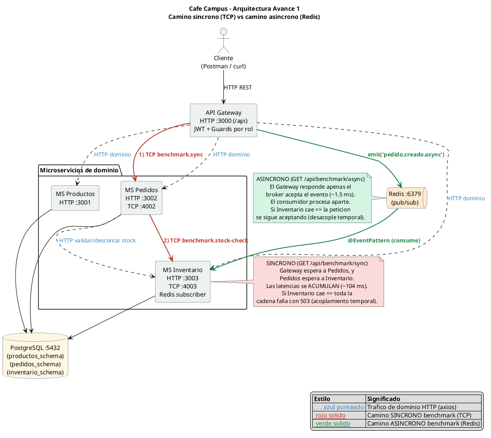

> Diagrama generado con **PlantUML**. Fuente:
> [`arquitectura-avance1.puml`](docs/planificacion-avance1/arquitectura-avance1.puml) ·
> versión vectorial: [`arquitectura-avance1.svg`](docs/planificacion-avance1/arquitectura-avance1.svg).
> Regenerar con: `plantuml -tpng docs/planificacion-avance1/arquitectura-avance1.puml`

Vista simplificada de los dos caminos:

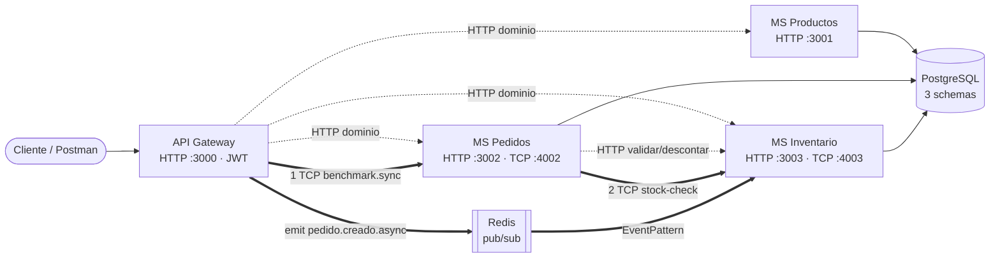
```mermaid
flowchart LR
    cliente([Cliente / Postman])
    gw[API Gateway<br/>HTTP :3000 · JWT]
    prod[MS Productos<br/>HTTP :3001]
    ped[MS Pedidos<br/>HTTP :3002 · TCP :4002]
    inv[MS Inventario<br/>HTTP :3003 · TCP :4003]
    pg[(PostgreSQL<br/>3 schemas)]
    redis[[Redis<br/>pub/sub]]

    cliente --> gw
    gw -. HTTP dominio .-> prod
    gw -. HTTP dominio .-> ped
    gw -. HTTP dominio .-> inv
    ped -. HTTP validar/descontar .-> inv
    prod --> pg
    ped --> pg
    inv --> pg

    gw == 1 TCP benchmark.sync ==> ped
    ped == 2 TCP stock-check ==> inv
    gw == emit pedido.creado.async ==> redis
    redis == EventPattern ==> inv
```

### Camino síncrono (TCP)

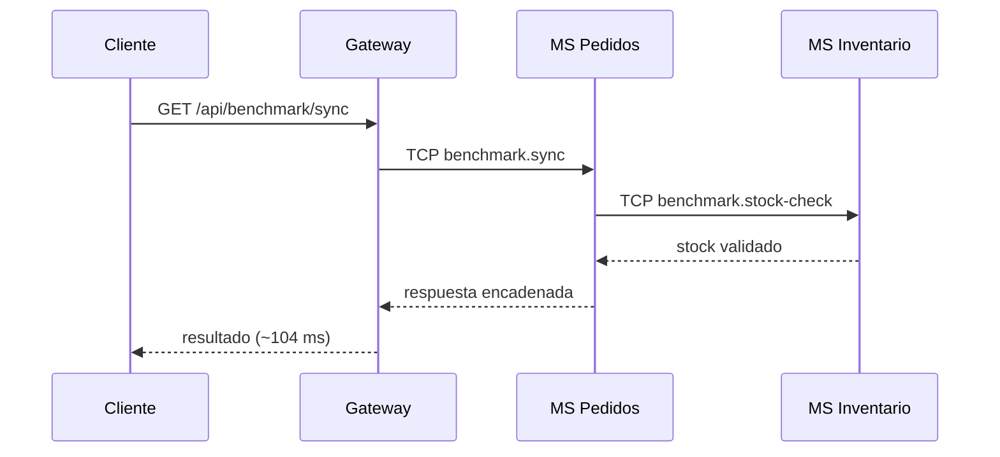
```mermaid
sequenceDiagram
    participant Cliente
    participant Gateway
    participant Pedidos as MS Pedidos
    participant Inventario as MS Inventario
    Cliente->>Gateway: GET /api/benchmark/sync
    Gateway->>Pedidos: TCP benchmark.sync
    Pedidos->>Inventario: TCP benchmark.stock-check
    Inventario-->>Pedidos: stock validado
    Pedidos-->>Gateway: respuesta encadenada
    Gateway-->>Cliente: resultado (~104 ms)
```

### Camino asíncrono (Redis)

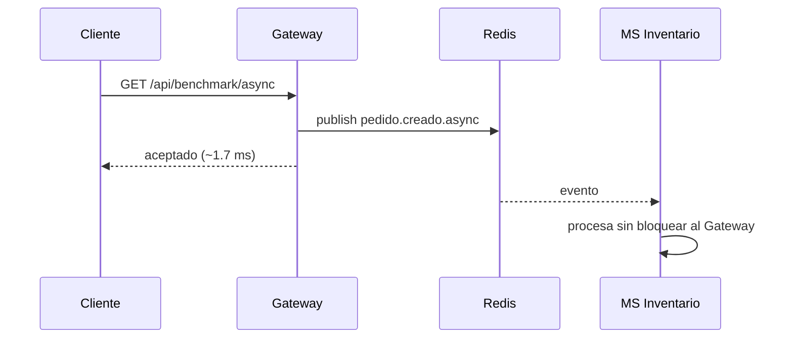
```mermaid
sequenceDiagram
    participant Cliente
    participant Gateway
    participant Redis
    participant Inventario as MS Inventario
    Cliente->>Gateway: GET /api/benchmark/async
    Gateway->>Redis: publish pedido.creado.async
    Gateway-->>Cliente: aceptado (~1.7 ms)
    Redis-->>Inventario: evento
    Inventario->>Inventario: procesa sin bloquear al Gateway
```

## Metodología

- **Kanban:** tablero en GitHub Projects:
  <https://github.com/users/Steft91/projects/1>. Ver también
  [`TABLERO_KANBAN.md`](TABLERO_KANBAN.md) y el reparto en
  [`docs/planificacion-avance1/01-roles-y-kanban.md`](docs/planificacion-avance1/01-roles-y-kanban.md)
  (capturas embebidas abajo).

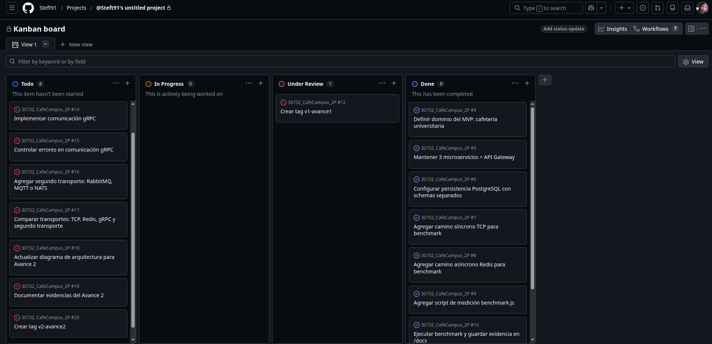


- **Ramificación:** **GitHub Flow** — `main` como rama principal y ramas `feat/…`, `chore/…` y `docs/…` para separar funcionalidades, configuración y documentación. Las ramas se integran mediante Pull Requests y se utiliza un **tag por avance**.

## Patrones y principios aplicados

Resumen (detalle y justificación en
[`docs/planificacion-avance1/02-patrones-y-principios.md`](docs/planificacion-avance1/02-patrones-y-principios.md)
y [`docs/planificacion-avance2/02-patrones-y-principios.md`](docs/planificacion-avance2/02-patrones-y-principios.md)):

| Patrón / Principio | ¿Framework o equipo? |
|---|---|
| API Gateway y Proxy | Diseñados por el equipo |
| Publisher/Subscriber (Redis) y Request/Response (TCP) | Equipo, utilizando transportes de NestJS |
| DTO, `ValidationPipe`, inyección de dependencias y módulos | Proporcionados por NestJS y utilizados deliberadamente |
| Excepciones HTTP y manejo controlado de errores | Framework y uso deliberado del equipo |
| SRP, separación de responsabilidades y aislamiento de datos por `schema` | Diseño del equipo |
| RPC con contrato gRPC y `.proto` compartido | Equipo, sobre `Transport.GRPC` de NestJS |
| Pub/Sub sobre cola durable RabbitMQ | Equipo, sobre `Transport.RMQ` de NestJS |
| JWT + Guards por rol | NestJS + diseño del equipo en Gateway |
| Observabilidad de errores con Sentry | Equipo, integrado en Gateway |
| UI por rol conectada al Gateway | Diseño del equipo con Angular |
---

## Avance 1 — Acoplamiento temporal y latencia · `tag v1-avance1`

### Caminos

- **Síncrono (TCP):** Gateway → MS Pedidos → MS Inventario (cada salto espera al siguiente).
- **Asíncrono (Redis):** Gateway publica el evento y responde sin esperar al consumidor.

| Camino    | Endpoint                   | Transporte |
| --------- | -------------------------- | ---------- |
| Síncrono  | `GET /api/benchmark/sync`  | TCP        |
| Asíncrono | `GET /api/benchmark/async` | Redis      |

### Latencia (200 peticiones, `benchmark.js`)

```bash
node benchmark.js http://localhost:3000/api/benchmark/sync 200 > docs/avance1-evidencias/avance1-benchmark-sync.txt
node benchmark.js http://localhost:3000/api/benchmark/async 200 > docs/avance1-evidencias/avance1-benchmark-async.txt
```

Para repetir la medición sin retardos artificiales:

```bash
BENCHMARK_PEDIDOS_DELAY_MS=0 BENCHMARK_INVENTARIO_DELAY_MS=0 docker compose up -d --force-recreate ms-pedidos ms-inventario gateway
node benchmark.js http://localhost:3000/api/benchmark/sync 200 > docs/avance1-evidencias/avance1-benchmark-sync-zero-delay.txt
node benchmark.js http://localhost:3000/api/benchmark/async 200 > docs/avance1-evidencias/avance1-benchmark-async-zero-delay.txt
```

| Camino          | Promedio (ms) | p95 (ms) | Máx (ms) | Errores |
| --------------- | ------------: | -------: | -------: | ------: |
| Síncrono TCP    |    **104.89** |   106.00 |   162.00 |       0 |
| Asíncrono Redis |      **1.67** |     2.00 |    70.00 |       0 |

Resultados adicionales con `BENCHMARK_PEDIDOS_DELAY_MS=0` y
`BENCHMARK_INVENTARIO_DELAY_MS=0`:

| Camino          | Promedio (ms) | p95 (ms) | Máx (ms) | Errores |
| --------------- | ------------: | -------: | -------: | ------: |
| Síncrono TCP    |      **6.85** |     9.00 |    67.00 |       0 |
| Asíncrono Redis |      **3.10** |     4.00 |    75.00 |       0 |

La comparación completa sin delays se documenta en
[`docs/planificacion-avance1/03-analisis-latencia-acoplamiento.md`](docs/planificacion-avance1/03-analisis-latencia-acoplamiento.md)
y queda respaldada por `docs/avance1-evidencias/avance1-benchmark-sync-zero-delay.txt`
y `docs/avance1-evidencias/avance1-benchmark-async-zero-delay.txt`.

### Acoplamiento temporal (prueba de caída)

Con el stack arriba, se apaga **MS Inventario** (Ctrl+C) y se repiten las peticiones
(evidencia en `docs/avance1-evidencias/avance1-caida-servicio.txt`):

- **Síncrono → falla** con `503 Service Unavailable`: la cadena Gateway→Pedidos→Inventario requiere que todos estén vivos a la vez.
- **Asíncrono → se acepta igual** (`"aceptado": true`, ~1 ms): el Gateway publica el evento en Redis y responde sin esperar una confirmación del consumidor. Esto demuestra un menor acoplamiento temporal desde la perspectiva del emisor.

**Resultados del benchmark del camino síncrono**

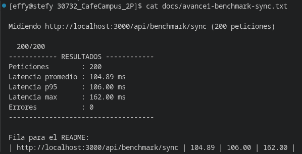

**Resultados del benchmark del camino asíncrono**

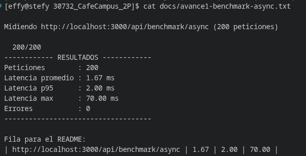

### Análisis

En el camino **síncrono**, cada salto espera la respuesta del siguiente antes de continuar, por lo que los tiempos de procesamiento se acumulan. El promedio medido fue de **104.89 ms**, valor coherente con los retardos artificiales de MS Pedidos (40 ms) y MS Inventario (60 ms), además del costo de comunicación entre procesos. La prueba de caída también evidenció **acoplamiento temporal**: al detener MS Inventario, la cadena no pudo completarse y el Gateway respondió con un error **503 Service Unavailable**.

En el camino **asíncrono**, el Gateway publica un evento mediante Redis Pub/Sub y responde sin esperar que MS Inventario complete su procesamiento. Por esta razón, el promedio de respuesta fue de **1.67 ms**. Incluso con el consumidor detenido, el Gateway aceptó la solicitud y respondió correctamente, evidenciando un menor acoplamiento temporal desde la perspectiva del emisor.

Sin embargo, Redis Pub/Sub utiliza mensajería no persistente. Por ello, esta implementación demuestra desacoplamiento temporal y reducción del tiempo de respuesta, pero no garantiza que un evento publicado mientras el consumidor está detenido sea procesado posteriormente.

Análisis ampliado en
[`docs/planificacion-avance1/03-analisis-latencia-acoplamiento.md`](docs/planificacion-avance1/03-analisis-latencia-acoplamiento.md).

---

## Avance 2 — Comunicación gRPC + RabbitMQ + excepciones · `tag v2-avance2`

### Comunicación gRPC

MS Pedidos consulta a MS Productos mediante gRPC antes de crear un pedido. El
contrato compartido se encuentra en [`proto/productos.proto`](proto/productos.proto).

El cliente envía únicamente `productoId` y `cantidad`. MS Pedidos obtiene mediante
gRPC el nombre, precio y disponibilidad reales del producto, evitando confiar en
valores proporcionados por el cliente.

### Flujo RabbitMQ

Después de crear el pedido, MS Pedidos publica el evento
`pedido.creado.rabbitmq`. MS Inventario consume el evento mediante
`@EventPattern`, utilizando una cola configurada como durable.

### Manejo de excepciones

Cuando se consulta un producto inexistente, MS Productos devuelve una
`RpcException` con código `NOT_FOUND`. MS Pedidos captura el error mediante
`try/catch` y lo traduce a una respuesta HTTP `422 Unprocessable Entity`, sin
detener ninguno de los servicios.

Además, los microservicios que exponen handlers internos registran un
`RpcExceptionFilter` global sobre sus transportes reales:
`ms-productos` en gRPC, `ms-pedidos` en TCP y `ms-inventario` en TCP/Redis/RabbitMQ.
Con esto las `RpcException` mantienen semántica RPC y no se degradan a errores
desconocidos del transporte.

### Comparación de transportes

| Transporte | Tipo | Patrón | Uso |
|---|---|---|---|
| TCP | Síncrono | Petición-respuesta | Benchmark Gateway → Pedidos → Inventario |
| Redis | Asíncrono | Pub/Sub efímero | Evento del benchmark del Avance 1 |
| gRPC | Síncrono | RPC con contrato `.proto` | Consulta Pedidos → Productos |
| RabbitMQ | Asíncrono | Evento sobre cola | Publicación Pedidos → Inventario |

Documentación ampliada:

- [Comparación de transportes y excepciones](docs/planificacion-avance2/03-comparacion-transportes-excepciones.md)
- [Patrones y principios aplicados](docs/planificacion-avance2/02-patrones-y-principios.md)
- [Roles y Kanban](docs/planificacion-avance2/01-roles-y-kanban.md)

### Evidencias

- [Pedido exitoso mediante gRPC](docs/avance2-evidencias/pedidos-grpc-rabbitmq.txt)
- [Evento RabbitMQ consumido](docs/avance2-evidencias/rabbitmq-inventario.txt)
- [Error gRPC controlado](docs/avance2-evidencias/error-producto-inexistente-grpc.txt)

**Pedido exitoso con datos reales obtenidos por gRPC**

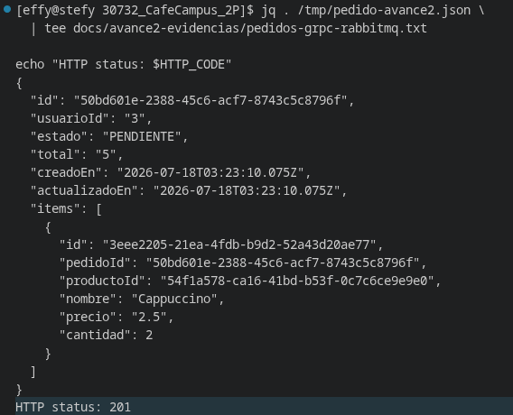

**Evento RabbitMQ consumido por MS Inventario**

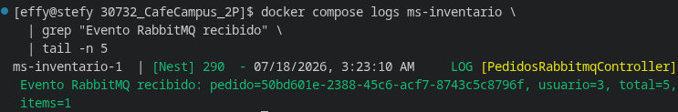

**Error controlado: producto inexistente -> HTTP 422**

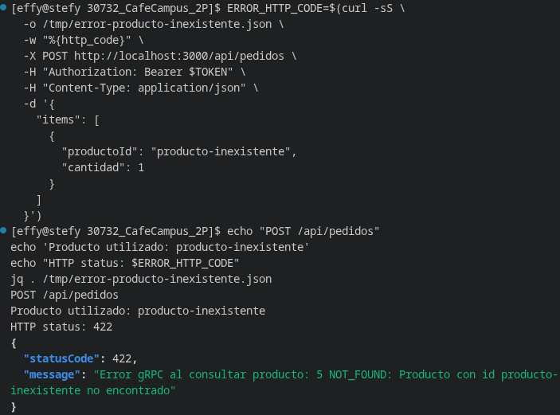

**Kanban al cierre del Avance 2**


**Evidencias fix post-retroalimentación**

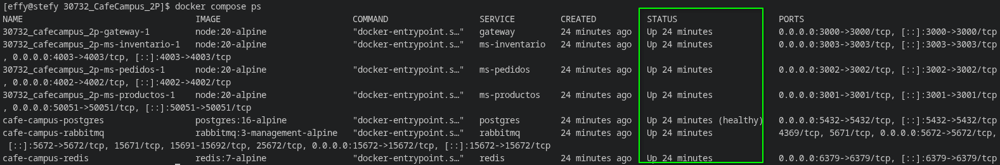
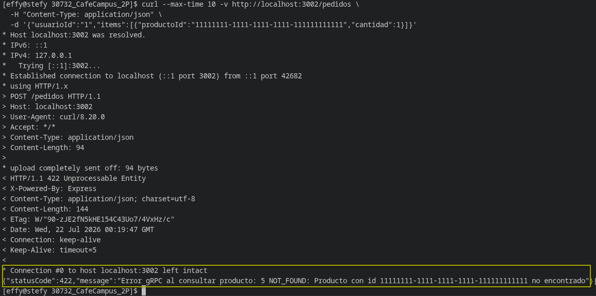
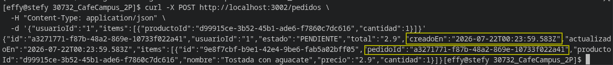
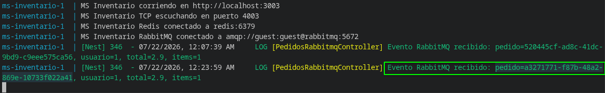

### Arquitectura del Avance 2

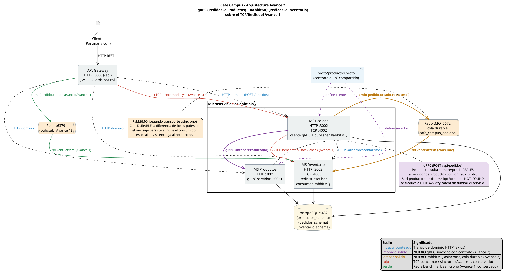

### Cómo probar el flujo del Avance 2

1. Levanta el stack:

   ```bash
   docker compose up -d
   ```

2. Si la base está limpia, siembra datos:

   ```bash
   docker compose exec ms-productos npm run seed
   docker compose exec ms-inventario npm run seed
   ```

3. Obtén un `productoId` válido:

   ```bash
   curl http://localhost:3001/productos
   ```

4. Crea un pedido contra `ms-pedidos`:

   ```bash
   curl -X POST http://localhost:3002/pedidos \
     -H "Content-Type: application/json" \
     -d '{"usuarioId":"1","items":[{"productoId":"PEGA_AQUI_UN_ID_REAL","cantidad":1}]}'
   ```

5. Observa el consumo RabbitMQ en inventario:

   ```bash
   docker compose logs -f ms-inventario
   ```

6. Prueba el error controlado con un producto inexistente:

   ```bash
   curl -X POST http://localhost:3002/pedidos \
     -H "Content-Type: application/json" \
     -d '{"usuarioId":"1","items":[{"productoId":"producto-inexistente","cantidad":1}]}'
   ```

   Debe responder `422 Unprocessable Entity` y mostrar el mensaje traducido
   por gRPC, sin tumbar los servicios.


## Avance 3 — Seguridad, observabilidad e integración (FINAL) · `tag v3-final`

### Seguridad y roles

El Gateway centraliza autenticación y autorización:

- `POST /api/auth/login` emite JWT para usuarios mock de demo.
- Rutas sin token responden `401 Unauthorized`.
- Rutas con token válido pero rol insuficiente responden `403 Forbidden`.
- Rutas con rol autorizado responden correctamente (`200`).

Evidencias:

- Login JWT: [`docs/avance3-evidencias/login-jwt.txt`](docs/avance3-evidencias/login-jwt.txt) · [`png`](docs/avance3-evidencias/login-jwt.png)
- Ruta autorizada: [`docs/avance3-evidencias/ruta-protegida-200.txt`](docs/avance3-evidencias/ruta-protegida-200.txt) · [`png`](docs/avance3-evidencias/ruta-con-token-valido-200.png)
- Sin token: [`docs/avance3-evidencias/ruta-sin-token-401.txt`](docs/avance3-evidencias/ruta-sin-token-401.txt) · [`png`](docs/avance3-evidencias/ruta-sin-token-401.png)
- Rol insuficiente: [`docs/avance3-evidencias/ruta-rol-sin-permiso-403.txt`](docs/avance3-evidencias/ruta-rol-sin-permiso-403.txt) · [`png`](docs/avance3-evidencias/rol-sin-permiso-403.png)

### Observabilidad

El Gateway integra Sentry para capturar errores HTTP relevantes con contexto de
servicio, ruta, método, estado y entorno. La evidencia usa un error controlado
de producto inexistente que pasa por Gateway y queda registrado en Sentry.

- Error controlado: [`docs/avance3-evidencias/error-controlado-status.txt`](docs/avance3-evidencias/error-controlado-status.txt)
- Evento en Sentry: [`docs/avance3-evidencias/avance3-sentry-error-capturado.png`](docs/avance3-evidencias/avance3-sentry-error-capturado.png)
- Tags/contexto: [`docs/avance3-evidencias/avance3-sentry-tags-contexto.png`](docs/avance3-evidencias/avance3-sentry-tags-contexto.png)

### Integración final

Flujo probado:

```text
Frontend/Postman -> Gateway JWT -> MS Pedidos -> MS Productos gRPC -> RabbitMQ -> MS Inventario
```

- Flujo integrado: [`docs/avance3-evidencias/flujo-integrado-final.txt`](docs/avance3-evidencias/flujo-integrado-final.txt) · [`png`](docs/avance3-evidencias/flujo-integrado-final.png)
- Evento RabbitMQ: [`docs/avance3-evidencias/flujo-integrado-rabbitmq-inventario.txt`](docs/avance3-evidencias/flujo-integrado-rabbitmq-inventario.txt) · [`png`](docs/avance3-evidencias/rabbitmq-recibido-inventario.png)
- Stack final: [`docs/avance3-evidencias/servicios-finales-ps.txt`](docs/avance3-evidencias/servicios-finales-ps.txt) · [`png`](docs/avance3-evidencias/servicios-finales.png)

### Evidencias post-retroalimentación para iniciar Avance 3

Estas capturas documentan que el repositorio quedó estable luego de aplicar la
retroalimentación del Avance 2. No reemplazan las evidencias finales del Avance
3; sirven como punto de partida verificable antes de las pruebas visuales del
frontend.

- [Trazabilidad de correcciones](docs/avance3-evidencias/fix/correcciones-avance2.md)

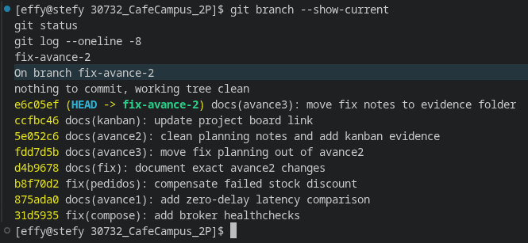

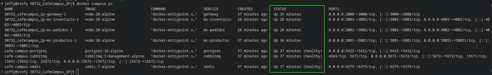

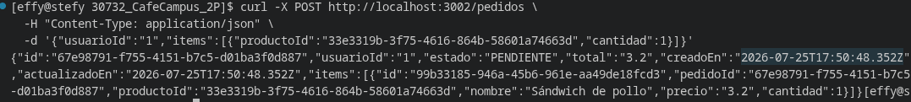

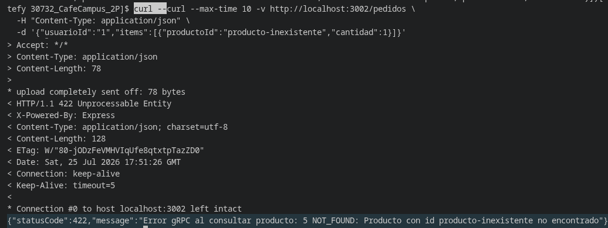

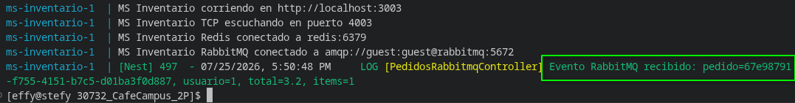

### Frontend de demo

Se agregó una interfaz Angular para mostrar el sistema como producto usable, no
solo como API:

- **Estudiante:** visualiza menú disponible, agrega al carrito, crea pedidos y consulta estado.
- **Mesero:** revisa pedidos y avanza estados de preparación.
- **Admin:** crea productos, cambia precio, pausa/activa disponibilidad, elimina productos y supervisa pedidos.

La interfaz consume exclusivamente el Gateway (`/api`) y respeta los permisos
configurados por rol.

#### Evidencias visuales del flujo frontend

Carpeta: [`docs/frontend-evidencias/`](docs/frontend-evidencias/)

- [`00.pantalla.inicio.png`](docs/frontend-evidencias/00.pantalla.inicio.png): vista inicial del frontend.
- [`01-login-demo.png`](docs/frontend-evidencias/01-login-demo.png): acceso con cuentas demo.
- [`02-estudiante-menu.png`](docs/frontend-evidencias/02-estudiante-menu.png): menú visible para estudiante.
- [`03-estudiante-carrito.png`](docs/frontend-evidencias/03-estudiante-carrito.png): carrito con productos agregados.
- [`04-estudiante-pedido-creado.png`](docs/frontend-evidencias/04-estudiante-pedido-creado.png): pedido creado desde la interfaz.
- [`05-mesero-pedidos.png`](docs/frontend-evidencias/05-mesero-pedidos.png): vista operativa de pedidos para mesero.
- [`06-mesero-cambio-estado.png`](docs/frontend-evidencias/06-mesero-cambio-estado.png): cambio de estado del pedido.
- [`07-admin-productos-crud.png`](docs/frontend-evidencias/07-admin-productos-crud.png): CRUD visual de productos para admin.
- [`08-admin-nuevo-producto.png`](docs/frontend-evidencias/08-admin-nuevo-producto.png): creación de producto desde admin.
- [`09-error-visual-controlado.png`](docs/frontend-evidencias/09-error-visual-controlado.png): error controlado visible en la interfaz.
- [`10-flujo-integracion-visual.png`](docs/frontend-evidencias/10-flujo-integracion-visual.png): sección visual del flujo integrado.

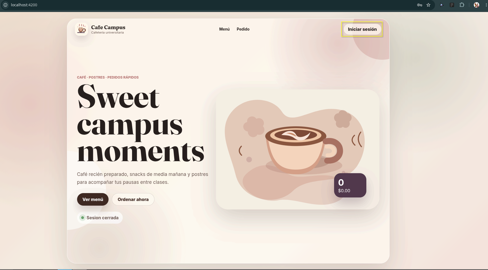

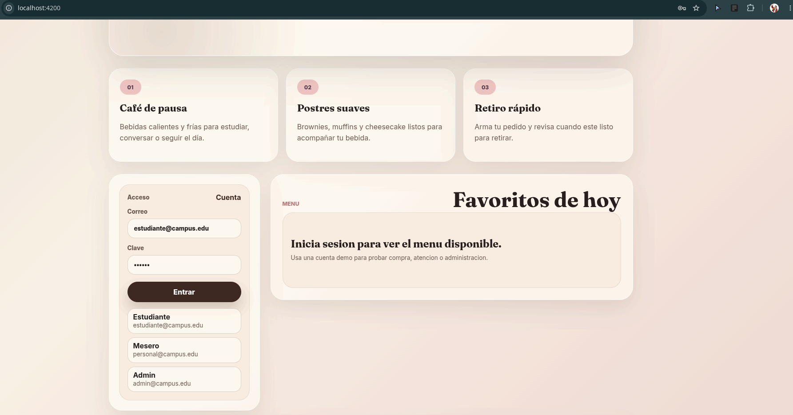

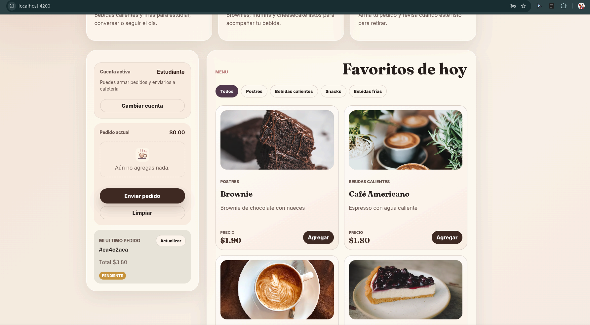

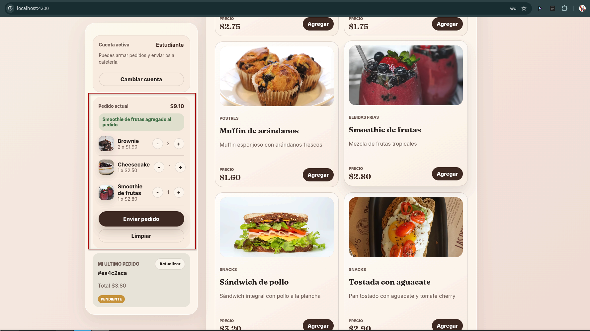

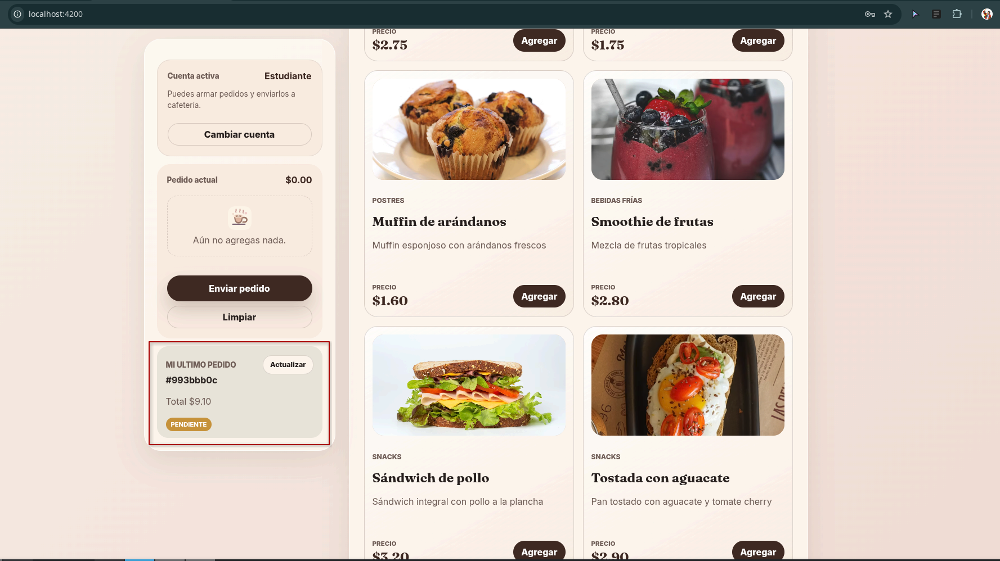

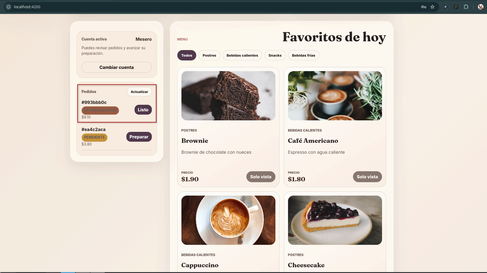

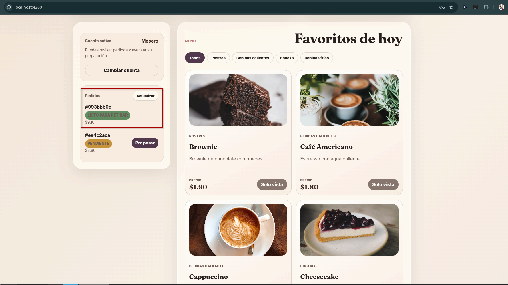

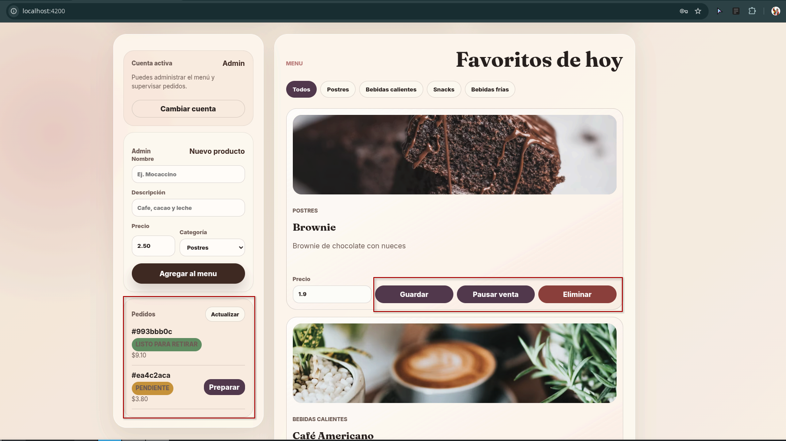

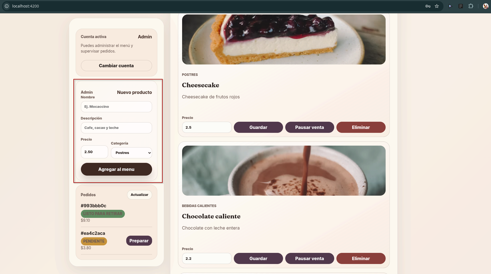

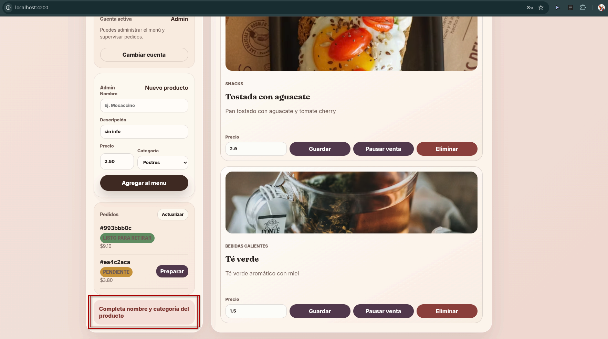

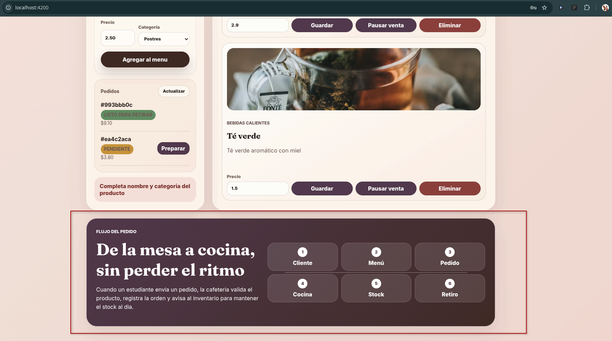

### Kanban final

Captura del tablero actualizado:
[`docs/avance3-evidencias/avance3-kanban.png`](docs/avance3-evidencias/avance3-kanban.png).

Planificación técnica del avance:
[`roles y Kanban`](docs/planificacion-avance3/01-roles-y-kanban.md) ·
[`patrones y principios`](docs/planificacion-avance3/02-patrones-y-principios.md) ·
[`seguridad, observabilidad e integración`](docs/planificacion-avance3/03-seguridad-observabilidad-integracion.md) ·
[`runbook de demo`](docs/planificacion-avance3/04-runbook-demo.md) ·
[`planificación final`](docs/planificacion-avance3/README.md).

## Defensa

La defensa se centra en explicar por qué cada transporte se usa en un caso
distinto:

- HTTP para entrada externa y pruebas simples.
- TCP para benchmark síncrono y demostración de latencia acumulada.
- Redis Pub/Sub para publicación rápida sin esperar consumidor.
- gRPC para consulta tipada de productos desde pedidos.
- RabbitMQ para evento durable de pedido creado hacia inventario.

Además, se demuestra control de acceso en Gateway con JWT/roles, observabilidad
con Sentry y una interfaz Angular que permite probar los flujos reales por rol.

## Tags de entrega

- `v1-avance1` — 2026-07-14
- `v2-avance2` — 2026-07-21 (tag retaggeado con correcciones, commit `c2c861e`)
- `v3-final` — pendiente
