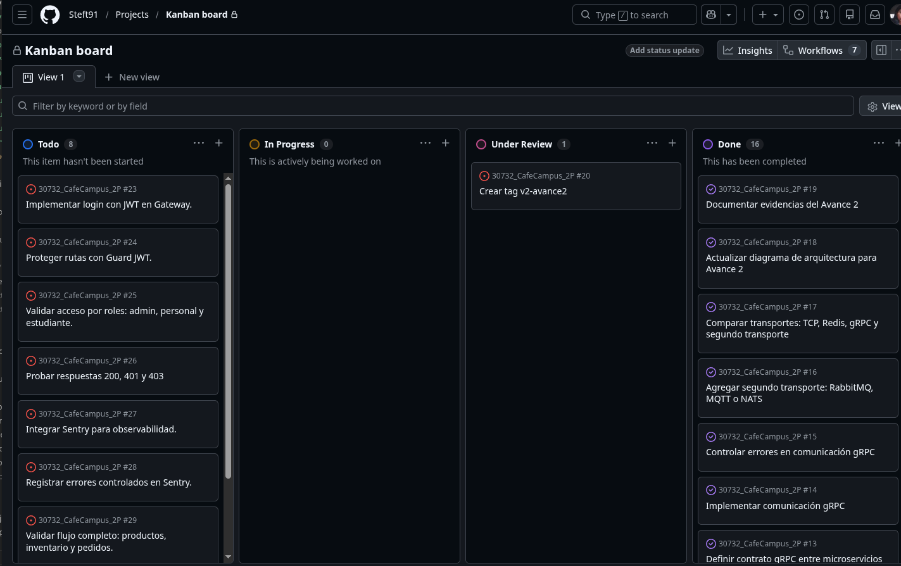
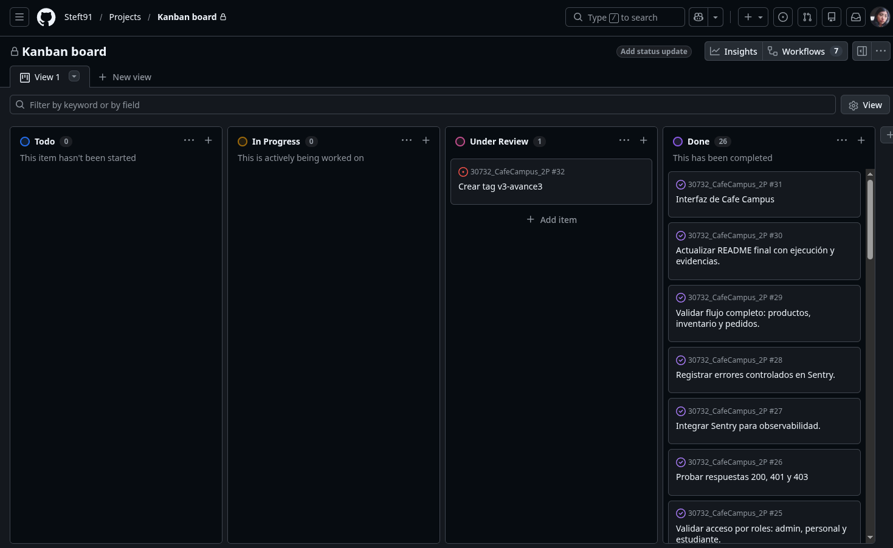

# Tablero Kanban - Cafe Campus

Flujo de columnas en GitHub Projects:

URL del tablero/proyectos del repositorio: <https://github.com/users/Steft91/projects/1>

`Backlog` -> `Por hacer` -> `En progreso` -> `En revision` -> `Hecho`

Cada tarjeta se trabaja en una rama independiente (`feat/…`, `chore/…`, `docs/…`)
y se integra a `main` mediante Pull Request, conservando la trazabilidad de los cambios. (GitHub Flow). El reparto detallado y la
propiedad por directorio estan en
[`docs/planificacion-avance1/01-roles-y-kanban.md`](docs/planificacion-avance1/01-roles-y-kanban.md),
[`docs/planificacion-avance2/01-roles-y-kanban.md`](docs/planificacion-avance2/01-roles-y-kanban.md)
y [`docs/planificacion-avance3/README.md`](docs/planificacion-avance3/README.md).

**Responsables:** **M** = Marcos Escobar · **T** = Mateo Sosa · **S** = Stefany Diaz.

## Avance 1 — Acoplamiento temporal y latencia (`v1-avance1`)

| Estado | Tarjeta | Resp. | Rama |
|---|---|---|---|
| [x] | Definir dominio del MVP: cafeteria universitaria (3 MS + Gateway) | Todos (M coordina) | — |
| [x] | Inicializar repositorio y proteger `main` | M | commit inicial en `main` |
| [x] | Docker Compose base (Gateway + 3 MS + Redis + Postgres) | M | `chore/setup-monorepo` |
| [x] | Script `benchmark.js` de medicion de latencia | M | `chore/setup-monorepo` |
| [x] | MS Productos — catalogo (CRUD + persistencia Prisma) | S | `feat/ms-productos` |
| [x] | MS Inventario — stock (CRUD + persistencia Prisma) | T | `feat/ms-inventario` |
| [x] | MS Pedidos — pedidos (CRUD + validacion de stock por HTTP) | T | `feat/ms-pedidos` |
| [x] | API Gateway — entrada HTTP + proxies + JWT/Guards | M | `feat/gateway` |
| [x] | Camino sincrono TCP (cadena Gateway->Pedidos->Inventario) | T (handlers) + M (cliente) | `feat/ms-inventario`, `feat/ms-pedidos`, `feat/gateway` |
| [x] | Camino asincrono Redis (evento, emisor no bloquea) | T (consumidor) + M (publisher) | `feat/ms-inventario`, `feat/gateway` |
| [x] | Manejo de excepciones en la capa de servicios | cada duenio en su servicio | ramas `feat/*` |
| [x] | Benchmark de latencia (prom/p95/max) + evidencia en `/docs` | S | `docs/avance1-evidencias` |
| [x] | Prueba de caida de MS downstream (acoplamiento temporal) | S | `docs/avance1-evidencias` |
| [x] | Diagrama de arquitectura v1 + README Avance 1 | S | `docs/avance1-evidencias` |
| [X] | Crear tag `v1-avance1` | M (release) | directo en `main` |

## Avance 2 — gRPC + RabbitMQ + manejo de excepciones (`v2-avance2`)

| Estado | Tarjeta | Resp. | Rama |
|---|---|---|---|
| [x] | Definir contrato `productos.proto` | M | `chore/grpc-rabbitmq-infra` |
| [x] | Agregar RabbitMQ y variables gRPC/RMQ a Docker Compose | M | `chore/grpc-rabbitmq-infra` |
| [x] | Montar el contrato `.proto` en Productos y Pedidos | M | `chore/grpc-rabbitmq-infra` |
| [x] | Exponer servidor gRPC en MS Productos | M | `feat/grpc-productos` |
| [x] | Consultar Productos mediante gRPC desde MS Pedidos | S | `feat/grpc-rabbitmq-pedidos` |
| [x] | Obtener nombre y precio reales mediante gRPC | S | `feat/grpc-rabbitmq-pedidos` |
| [x] | Publicar `pedido.creado.rabbitmq` desde MS Pedidos | S | `feat/grpc-rabbitmq-pedidos` |
| [x] | Consumir el evento RabbitMQ en MS Inventario | T | `feat/rabbitmq-inventario` |
| [x] | Traducir producto inexistente de gRPC a HTTP 422 | M + S | ramas de Productos y Pedidos |
| [x] | Generar evidencias de gRPC, RabbitMQ y error controlado | S | `docs/avance2-evidencias` |
| [x] | Actualizar tabla comparativa y diagrama | S | `docs/avance2-evidencias` |
| [x] | Actualizar README y documentación | S | `docs/avance2-evidencias` |
| [x] | Crear tag `v2-avance2` después del merge final | S | sobre `main` |

## Avance 3 — Seguridad, observabilidad e integracion (`v3-final`)

| Estado | Tarjeta | Resp. | Rama |
|---|---|---|---|
| [x] | Login JWT base en Gateway (mock in-memory) | M | `feat/gateway` (Avance 1) |
| [x] | Guards por rol en Gateway | M | `feat/gateway` (Avance 1) |
| [x] | Compose final con JWT/Sentry y puertos sin conflicto | M | `chore/compose-final` |
| [x] | Configurar expiracion JWT por variable `JWT_EXPIRES_IN` | M | `feat/jwt-sentry-gateway` |
| [x] | Integrar Sentry en Gateway | M | `feat/jwt-sentry-gateway` |
| [x] | Inicializar Sentry y registrar filtro global | M | `feat/jwt-sentry-gateway` |
| [x] | Configurar proyecto Angular del demo | T | `feat/frontend-base` |
| [x] | Agregar identidad visual de cafeteria | T | `feat/frontend-base` |
| [x] | Implementar interfaz por roles de cafeteria | S | `feat/frontend-roles` |
| [x] | Evidenciar login que emite JWT | S | `docs/avance3` |
| [x] | Evidenciar ruta protegida con token valido (200) | S | `docs/avance3` |
| [x] | Evidenciar ruta sin token o token invalido (401) | S | `docs/avance3` |
| [x] | Evidenciar rol sin permiso (403) | S | `docs/avance3` |
| [x] | Capturar error controlado en panel Sentry | S | `docs/avance3` |
| [x] | Validar flujo final Gateway -> Pedidos -> Productos gRPC -> RabbitMQ -> Inventario | Todos | `docs/avance3` |
| [x] | Consolidar README final con frontend, arquitectura, excepciones y defensa | S | `docs/avance3` |
| [x] | Adjuntar captura actualizada del tablero final | S | `docs/avance3` |
| [ ] | Crear tag `v3-final` | M | directo en `main` |

## Estado del tablero al cierre del Avance 3

| Backlog | Por hacer | En progreso | En revision | Hecho |
|---|---|---|---|---|
| — | Tag `v3-final` | — | — | JWT configurable + Guards por rol |
| — | — | — | — | Evidencias 200/401/403 |
| — | — | — | — | Sentry integrado y evidenciado |
| — | — | — | — | Flujo final JWT + gRPC + RabbitMQ |
| — | — | — | — | Compose final con puertos sin conflicto |
| — | — | — | — | Frontend Angular por roles |
| — | — | — | — | Admin de productos desde interfaz |
| — | — | — | — | README, runbook, guion y tablero actualizados |

## Capturas del tablero

**Avance 2**

**Avance 3 final**

