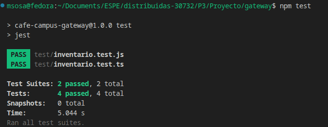

# Bitácora — Examen Final

> **Cópiame a `docs/examen/<tu-usuario-github>/BITACORA.md` y rellena todas las secciones.**
> Es obligatoria. Sin ella, C5 = nivel 1. Sin la sección 5 (uso de IA), **C5 = 0**.
> Escribe en primera persona y sé concreto: los "archivo:línea" se verifican.

---

## 0. Identificación

| | |
|---|---|
| **Nombre** | Mateo Sosa |
| **Usuario GitHub** | @MatSosa1 |
| **Grupo / Proyecto** | CafeCampus |
| **Actividad asignada** | **E** - Filtro de excepciones y códigos |
| **Rama** | `exam/matsosa1` |
| **Tag** | `examen-matsosa1` |
| **Pull Request** | *(enlace)* |
| **Tarjeta Kanban** | [https://github.com/Steft91/30732_ProyectoCafeCampus/issues/22](https://github.com/Steft91/30732_ProyectoCafeCampus/issues/22) |
| **¿Hiciste el Paso 0?** | No |

---

## 1. Qué construí

### Tabla de Flujos

El examen requería como primera actividad realizar una tabla de flujos con respecto a los errores que entregaba el sistema con Axios.
Se añadió una tabla en la carpeta `docs/` [(Tabla de Flujos de Error)](./flujos_error.md)

### Filtro Global de Excepciones

Debido a que Axios ya maneja sus excepciones, se utilizó los códigos de error de Axios como filtro global de excepciones.
Así, si se desea implementar algún otro microservicio, únicamente será necesario utilizar la función `request()` que implementa las excepciones globales de Axios.

### Corrección de Errores en Código

---

## 2. Anclaje con el repositorio de mi grupo — **obligatorio (C2)**

*Código que YA existía y con el que mi cambio se conecta. Cita archivo y línea reales, verificables en el repo. Si dejas esta tabla vacía o con referencias inventadas, C2 no pasa de nivel 1.*

| Código preexistente | Archivo:línea | Cómo me conecto con él |
|---|---|---|
| Controlador Proxy de Inventario | `inventario-proxy.controller.ts` | Puerto 3000 |
| Servicio Proxy de Inventario | `inventario-proxy.service.ts` | Puerto 3000 |
| Controlador Proxy de Pedidos | `pedidos-proxy.controller.ts` | Puerto 3000 |
| Servicio Proxy de Pedidos | `pedidos-proxy.service.ts` | Puerto 3000 |
| Controlador Proxy de Productos | `productos-proxy.controller.ts` | Puerto 3000 |
| Servicio Proxy de Productos | `productos-proxy.service.ts` | Puerto 3000 |

**¿Qué convención del repositorio seguí para que mi código no desentone?**

Se mantuvo la estructura por defecto del proyecto.
Lo que se modificó fueron los archivos controladores, manteniendo la estructura por clases que ya se maneja.


**¿Qué NO dupliqué, pudiendo hacerlo?**

No dupliqué código de errores de rutas ni excepciones específicas por cada _endpoint_ del proyecto.

No generé un nuevo archivo global de excepciones, sino que actualicé las rutas con una función `request()` que detecta los errores específicos mediante Axios.

---

## 3. Decisiones técnicas

*Al menos dos decisiones reales, con la alternativa que descartaste y por qué. Una decisión sin alternativa descartada no es una decisión.*

### Decisión 1

- **Qué decidí:** Utilizar las excepciones de Axios
- **Alternativa que descarté:** Añadir excepciones propias
- **Por qué:** Axios ya maneja eficientemente las excepciones. Si se generan excepciones propias, solo se duplicaría código

### Decisión 2
- **Qué decidí:** Generar función `request()` en cada microservicio.
- **Alternativa que descarté:** Generar clase HttpClient con la función `request()`
- **Por qué:** Aunque puede ayudar a no duplicar código en gran medida, separarlo por microservicio ayuda a conocer de qué microservicio se lanzan las excepciones.

---

## 4. Las 3 preguntas de mi actividad

*Están al final de tu actividad en `ACTIVIDADES.md`. Cópialas y respóndelas. Se evalúa que las respuestas hablen de **tu** implementación y de **tu** sistema, no en general.*

**Pregunta 1: ¿Por qué devolver **201 con un cuerpo `{status:'FAILED'}`** es un problema para quien consume tu API? Da un ejemplo concreto de qué se rompe.**

> Si la API devuelve un 201 junto con un cuerpo como { status: 'FAILED' }, existe una contradicción entre el protocolo HTTP y el contenido de la respuesta.

**Pregunta 2: ¿Cuál es la diferencia entre **409** y **422**, y cuál usaste en tu caso? Justifica.**

> 409 se utiliza cuando la solicitud entra en conflicto con el estado actual del recurso. 422 se utiliza cuando la solicitud es sintácticamente válida, pero no puede procesarse por lógica de negocio.

**Pregunta 3: ¿Por qué el filtro **no debe** devolver al cliente el mensaje original de la excepción? ¿Qué se arriesga?**

> Porque este puede contener información sensible sobre la implementación interna del sistema.

---

## 5. Uso de Inteligencia Artificial — **obligatorio**

**¿Usaste IA en este examen?** Sí

> Usarla no penaliza. **No declararla anula este criterio completo (C5 = 0).**
> Si marcaste "No", firma igualmente la declaración del final.

| # | Qué le pedí | Qué me devolvió | Qué corregí, adapté o descarté — y por qué |
|:--:|---|---|---|
| 1 | Una explicación de cómo generar excepciones de forma global | "Axios ya dispone de sus propias excepciones al llamarse" | Descarté la función principal que era global por una por microservicios |

**¿En qué se equivocó respecto a mi repositorio?**

Interpretó que era un MVC al principio, sin uso de DTOs ni controladores ni servicios, por lo que tocó adaptar la función obtenida para el proyecto.

---

## 6. Evidencia

| Archivo | Qué demuestra |
|---|---|
| `antes_statuscode.png` | Error tipo 404 cuando no es autorizado a revisar la ruta |
| `despues_statuscode.png` | Error tipo 401 _Unauthorized_ cuando no es autorizado |

**Cómo reproducir mi cambio desde cero:**

```bash
# comandos exactos: levantar, autenticarse, ejecutar el caso
# Gateway
cd gateway
npm i

# Global
cd ..
docker compose up

```

---

## 7. Prueba automatizada

| | |
|---|---|
| **Archivo de la prueba** | `gateway/test/inventario.test.ts` |
| **Comando para ejecutarla** | `npm test` |
| **Qué verifica** | Comprueba si los códigos de error son correctos |
| **¿Falla sin mi cambio?** | No, existe un error 404 pero no siempre es el adecuado |



---

## 8. Estado final — honesto

**Funciona:**
- Sí

---

## 9. Declaración

> Declaro que este trabajo es individual, que corresponde a la actividad que me fue asignada, y que la sección 5 refleja de forma completa y veraz el uso que hice de herramientas de Inteligencia Artificial durante el examen.

**Nombre:** Mateo Sosa
**Fecha:** 27/07/2026
